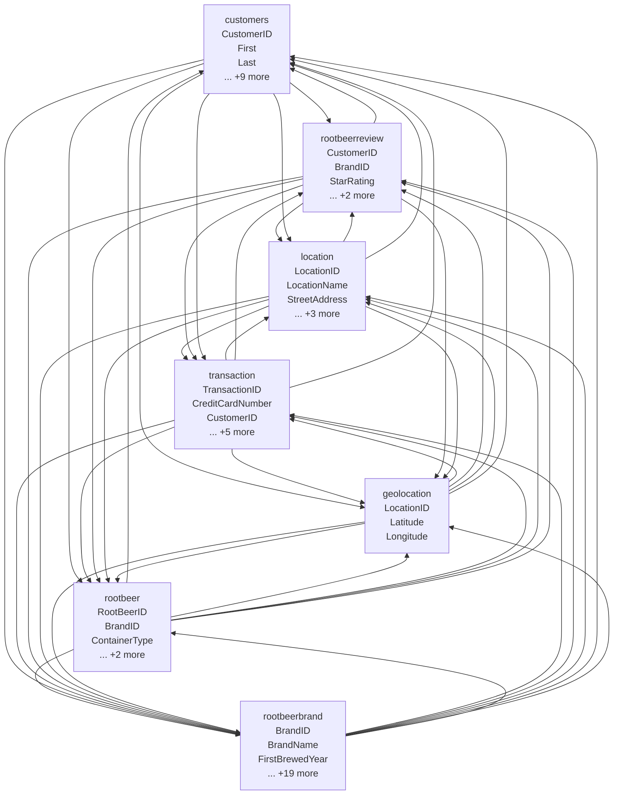

# BEER_FACTORY Database Schema

```mermaid
graph TD
    customers["customers<br/>CustomerID<br/>First<br/>Last<br/>... +9 more"]
    geolocation["geolocation<br/>LocationID<br/>Latitude<br/>Longitude"]
    location["location<br/>LocationID<br/>LocationName<br/>StreetAddress<br/>... +3 more"]
    rootbeerbrand["rootbeerbrand<br/>BrandID<br/>BrandName<br/>FirstBrewedYear<br/>... +19 more"]
    rootbeer["rootbeer<br/>RootBeerID<br/>BrandID<br/>ContainerType<br/>... +2 more"]
    rootbeerreview["rootbeerreview<br/>CustomerID<br/>BrandID<br/>StarRating<br/>... +2 more"]
    transaction["transaction<br/>TransactionID<br/>CreditCardNumber<br/>CustomerID<br/>... +5 more"]
    customers --> rootbeerreview
    transaction --> location
    transaction --> rootbeerreview
    rootbeerreview --> location
    rootbeer --> customers
    transaction --> customers
    rootbeer --> geolocation
    rootbeerreview --> customers
    customers --> geolocation
    location --> transaction
    transaction --> geolocation
    customers --> rootbeer
    location --> rootbeerreview
    rootbeerreview --> geolocation
    transaction --> rootbeer
    rootbeerreview --> rootbeer
    rootbeer --> rootbeerbrand
    rootbeerbrand --> transaction
    customers --> rootbeerbrand
    location --> customers
    transaction --> rootbeerbrand
    rootbeerbrand --> rootbeerreview
    geolocation --> transaction
    rootbeerbrand --> location
    rootbeerreview --> rootbeerbrand
    location --> geolocation
    geolocation --> rootbeerreview
    geolocation --> location
    rootbeerbrand --> customers
    location --> rootbeer
    geolocation --> customers
    rootbeerbrand --> geolocation
    location --> rootbeerbrand
    rootbeerbrand --> rootbeer
    geolocation --> rootbeer
    rootbeerreview --> transaction
    geolocation --> rootbeerbrand
    customers --> transaction
    rootbeer --> transaction
    rootbeer --> location
    rootbeer --> rootbeerreview
    customers --> location
```
