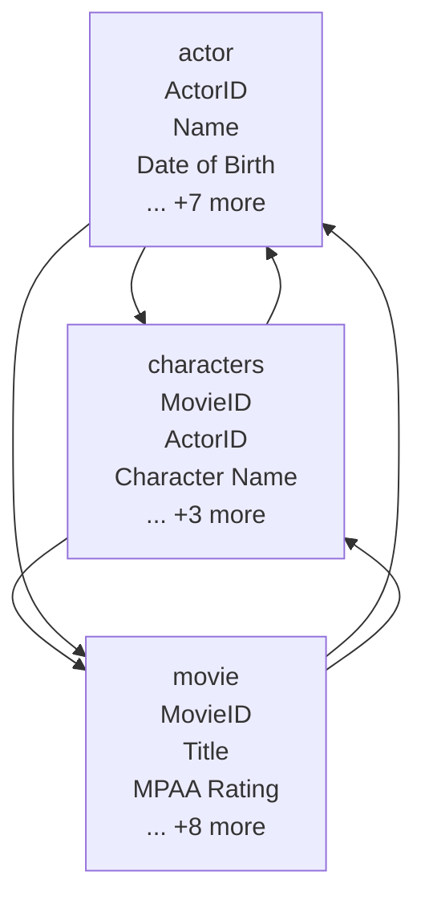

# MOVIE Database Schema

```mermaid
graph TD
    actor["actor<br/>ActorID<br/>Name<br/>Date of Birth<br/>... +7 more"]
    movie["movie<br/>MovieID<br/>Title<br/>MPAA Rating<br/>... +8 more"]
    characters["characters<br/>MovieID<br/>ActorID<br/>Character Name<br/>... +3 more"]
    movie --> actor
    characters --> movie
    movie --> characters
    actor --> characters
    actor --> movie
    characters --> actor
```
