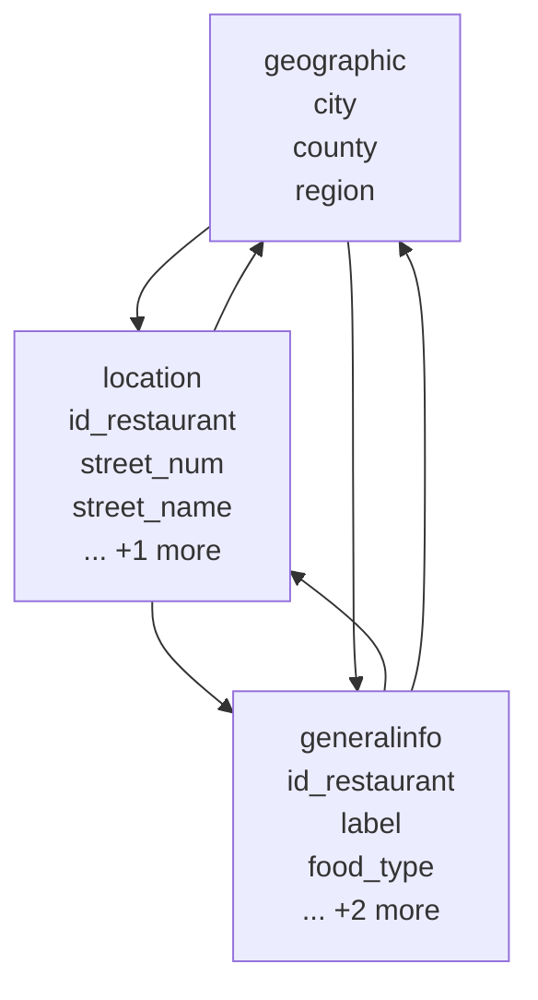

# RESTAURANT Database Schema

```mermaid
graph TD
    geographic["geographic<br/>city<br/>county<br/>region"]
    generalinfo["generalinfo<br/>id_restaurant<br/>label<br/>food_type<br/>... +2 more"]
    location["location<br/>id_restaurant<br/>street_num<br/>street_name<br/>... +1 more"]
    geographic --> location
    generalinfo --> location
    location --> generalinfo
    location --> geographic
    generalinfo --> geographic
    geographic --> generalinfo
```
