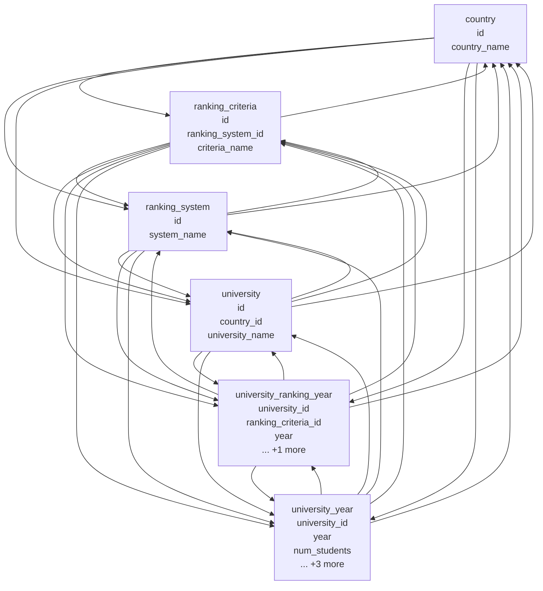

# UNIVERSITY Database Schema

```mermaid
graph TD
    country["country<br/>id<br/>country_name"]
    ranking_system["ranking_system<br/>id<br/>system_name"]
    ranking_criteria["ranking_criteria<br/>id<br/>ranking_system_id<br/>criteria_name"]
    university["university<br/>id<br/>country_id<br/>university_name"]
    university_ranking_year["university_ranking_year<br/>university_id<br/>ranking_criteria_id<br/>year<br/>... +1 more"]
    university_year["university_year<br/>university_id<br/>year<br/>num_students<br/>... +3 more"]
    ranking_system --> country
    university_ranking_year --> ranking_system
    university --> university_ranking_year
    university --> university_year
    university_ranking_year --> university
    country --> ranking_criteria
    ranking_criteria --> country
    ranking_system --> university
    ranking_criteria --> ranking_system
    university_year --> ranking_criteria
    ranking_system --> university_ranking_year
    university_ranking_year --> university_year
    university_year --> country
    ranking_system --> university_year
    country --> ranking_system
    ranking_criteria --> university
    university --> ranking_criteria
    university_year --> ranking_system
    university --> country
    ranking_criteria --> university_ranking_year
    country --> university
    university --> ranking_system
    ranking_criteria --> university_year
    university_year --> university
    university_ranking_year --> ranking_criteria
    country --> university_ranking_year
    ranking_system --> ranking_criteria
    university_year --> university_ranking_year
    country --> university_year
    university_ranking_year --> country
```
